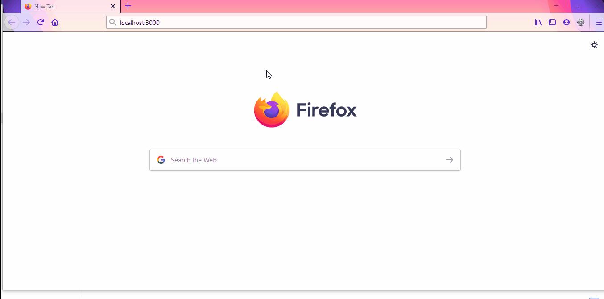

_This is a react project which implements a video browser by searching through youtube's public api._

# Demo:

# Usage: 
Download the source code of this app and run the following lines of code in a git and npm enabled editor

`git clone https://github.com/Gagan-Aptagiri/video-browser.git`

`npm install`

`npm start` 
